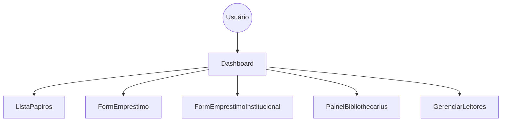

# 🏗️ Arquitetura do Sistema

O sistema [[Alexandria_Mapa|Alexandria]] foi construído seguindo uma arquitetura de aplicação moderna focada em performance e experiência do usuário (UX).

## Estrutura de Componentes
O componente central é o [[Dashboard]], que atua como o orquestrador de visões:

## Camada de Dados
- **Supabase Client**: Gerencia a conexão em tempo real com o banco.
- **Realtime Subscription**: O Catálogo se atualiza automaticamente quando um livro é retirado.
- **Storage**: Bucket `papiros-capas` armazena as imagens físicas das capas.

---
[[Entidades e Banco de Dados|Ver Entidades]] | [[Alexandria_Mapa|Voltar ao Início]]
