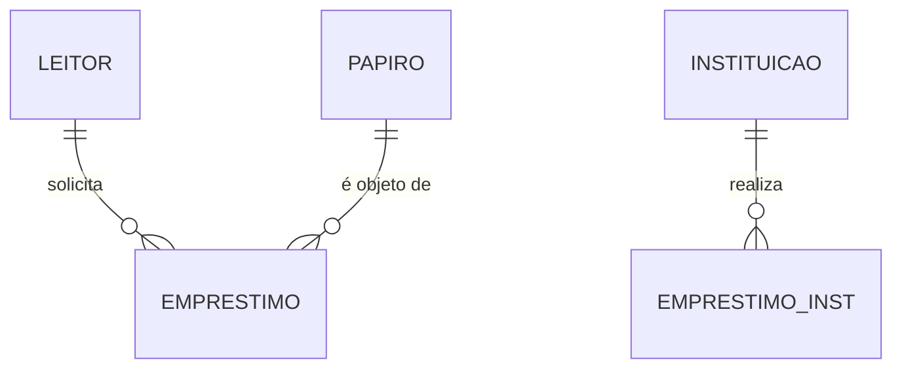

# 🗄️ Entidades e Banco de Dados

Representação do modelo de dados relacional que sustenta o [[Arquitetura do Sistema|Sistema]].

## Tabelas Principais (PostgreSQL)

### 📜 Papiros (Acervo)
- `titulo`: Nome da obra.
- `autor`: Escritor.
- `status`: [disponivel, emprestado, restauro].
- `isbn`: Identificador único.
- `imagem_url`: Link para a capa no Supabase Storage.

### 👤 Leitores Externos
- Cadastro centralizado de usuários que não são administradores.
- Possui vínculo de histórico com [[Fluxos de Negócio|Papiros]].

### 🏛️ Instituições
- Registros para parcerias externas.
- Permite [[Fluxos de Negócio|Empréstimos Institucionais]].

## Relacionamentos

---
[[Fluxos de Negócio|Ver Processos]] | [[Alexandria_Mapa|Voltar ao Início]]
